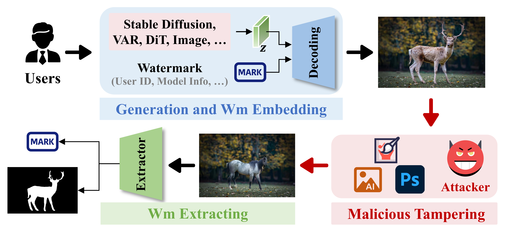

<div align="center">


<h1>GenPTW: Latent Image Watermarking for Provenance Tracing and Tamper Localization</h1>

<p>
<b><a href="https://github.com/GanZhenliang">Zhenliang Gan</a></b><sup>1</sup> ·
<b>Chunya Liu</b><sup>2</sup> ·
<b><a href="https://github.com/yichao-tang">Yichao Tang</a></b><sup>1</sup> ·
<b>Binghao Wang</b><sup>2</sup> ·
<b>Shiwen Cui</b><sup>2</sup> ·
<b>Weiqiang Wang</b><sup>2</sup> ·
<b><a href="https://scholar.google.com/citations?user=P76GtHwAAAAJ&hl=zh-CN">Xinpeng Zhang</a></b><sup>1*</sup>
</p>

<p style="font-size: 14px; opacity: 0.85;">
<sup>1</sup> College of Computer Science and Artificial Intelligence, Fudan University, China<br>
<sup>2</sup> Ant Group, China
</p>

<p style="margin-top: 10px;">
📧 <b>Contact</b>:  
<a href="mailto:zlgan23@m.fudan.edu.cn">zlgan23@m.fudan.edu.cn</a> ·
{<a href="mailto:liuchunya.lcy@antgroup.com">liuchunya.lcy</a>, 
<a href="mailto:weiqiang.wwq@antgroup.com">weiqiang.wwq</a>, 
<a href="mailto:binghao.wbh@antgroup.com">binghao.wbh</a>, 
<a href="mailto:donn.csw@antgroup.com">donn.csw</a>}@antgroup.com ·
{<a href="mailto:yichao.tang@fudan.edu.cn">yichao.tang</a>, 
<a href="mailto:zhangxinpeng@fudan.edu.cn">zhangxinpeng</a>}@fudan.edu.cn
</p>

<p style="margin-top: 6px;">
<sup>*</sup> <b>Corresponding author</b>
</p>
</div>

---

## 🎬 Overview



We propose **GenPTW**, a **Gen**eral watermarking framework that unifies **P**rovenance tracing and **T**amper localization in latent space. 


---

## 🖼️ Results


<p align="center">
  
</p>


---

## 🚀 Training

```bash
accelerate launch genptw_train.py
```
#### Required Components

| Component        | Description             | Path                                                         |
| ---------------- | ----------------------- | ------------------------------------------------------------ |
| 📂 Dataset        | COCO2017 train          | COCO2017: [Train images](http://images.cocodataset.org/zips/train2017.zip), [annotations](http://images.cocodataset.org/annotations/annotations_trainval2017.zip) |
| VAE              | Stable Diffusion 2 Base | [`--pretrained_vae`](https://huggingface.co/Manojb/stable-diffusion-2-base/tree/main/vae) |
| Localizer        | ConvNeXt backbone       | [`--pretrained_ConvNeXt`](https://download.pytorch.org/models/convnext_tiny-983f1562.pth) |
| Inpainting Model | SD2 Inpainting          | [`--pretrained_pipe_sd`](https://huggingface.co/sd2-community/stable-diffusion-2-inpainting) |
| Inpainting Model | LaMA                    | os.environ["LAMA_MODEL"] = ["big-lama.pt" ](https://github.com/enesmsahin/simple-lama-inpainting/releases/download/v0.1.0/big-lama.pt) |

### ⚙️ Training Configuration

The main hyper-parameters used in `genptw_train.py` are listed below:

| Category     | Parameter                     | Description            | Default |
| ------------ | ----------------------------- | ---------------------- | ------- |
| Data         | `resolution`                  | Input image resolution | 512     |
| Data         | `train_batch_size`            | Batch size             | 2       |
| Watermark    | `phi_dimension`               | Watermark bit length   | 64      |
| Optimization | `learning_rate`               | Learning rate          | 1e-5    |
| Optimization | `num_train_epochs`            | Training epochs        | 20      |
| Optimization | `gradient_accumulation_steps` | Gradient accumulation  | 8       |

## 🧪 Testing

**Step 1. Download Checkpoint**

Download the pretrained 📦[checkpoint](https://drive.google.com/file/d/1nC85Jc0B6K5ycqRHN0NFWVQP2jSLHsoT/view?usp=drive_link), and organize it as:

Checkpoint/
 ├── msg_decoder.pth
 ├── localizer.pth
 └── diffusion_pytorch_model.safetensors

Then update the corresponding paths in `Test.py`.

---

**Step 2. Prepare Dataset**

Download the [COCO2017 validation set](http://images.cocodataset.org/zips/val2017.zip).

Ensure that the image resolution, watermark bit length, and other hyper-parameters in `Test.py` are consistent with the training configuration.

---

**Run testing:**

```bash
python Test.py \
  --test_img_dir /path/to/val2017 \
  --test_ann_file /path/to/instances_val2017.json \
  --pretrained_ckpt ./Checkpoint
```

## 🧪 Inference (infer.py)

Set the required parameters in `infer.py`, then run inference for text-to-image generation with watermark embedding.

```
python infer.py
```

## 📰 News

- 🎉🎉🎉🎉 Our work has been featured by multiple official media platforms:
  - College of Computer Science and Artificial Intelligence, Fudan University (Official WeChat):  [Link](https://mp.weixin.qq.com/s/FZIsAgNl390PSjNCeJGBwA)

  - Ant Group (AntTech Official WeChat):  [Link](https://mp.weixin.qq.com/s/Yg3sFTPT03PXPxBJvKUmjg)

  - Netinfo Security Official WeChat:  [Link](https://mp.weixin.qq.com/s/of2Mi477YcUuQXDEZEvJJA)
  - Additional coverage:  [Link](https://mp.weixin.qq.com/s/gv9OEoDcvkgXvyyrU37bhQ)

- 🎉🎉🎉 Our code has been released and the project is continuously being updated.
- 🎉🎉🎉 Congratulations to GenPTW being accepted by AAAI 2026!

## 📣 GenPTW: Poster Presentation at AAAI 2026


## 📜 BibTeX

```
@inproceedings{gan2026genptw,
  title={GenPTW: Latent Image Watermarking for Provenance Tracing and Tamper Localization},
  author={Gan, Zhenliang and Liu, Chunya and Tang, Yichao and Wang, Binghao and Cui, Shiwen and Wang, Weiqiang and Zhang, Xinpeng},
  booktitle={Proceedings of the AAAI Conference on Artificial Intelligence},
  volume={40},
  number={5},
  pages={4085--4093},
  year={2026}
}
```

